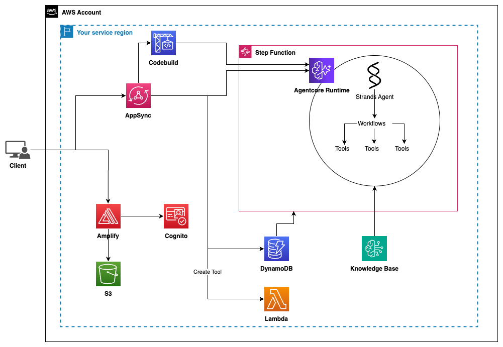

# Guidance for Intelligent Legacy to SaaS Application Migration

## Table of Contents

1. [Overview](#overview-required)
   - [Cost](#cost)
2. [Prerequisites](#prerequisites-required)
   - [Operating System](#operating-system-required)
3. [Deployment Steps](#deployment-steps-required)
4. [Deployment Validation](#deployment-validation-required)
5. [Running the Guidance](#running-the-guidance-required)
6. [Next Steps](#next-steps-required)
7. [Cleanup](#cleanup-required)
8. [Notices](#notices-optional)

**_Optional_**

8. [FAQ, known issues, additional considerations, and limitations](#faq-known-issues-additional-considerations-and-limitations-optional)
9. [Revisions](#revisions-optional)
10. [Authors](#authors-optional)

## Overview

The solution guidance aims to help customers create or use AI-powered tools to accelerate their migration assessment processes while providing transparency and justification for the decisions made.

### Cost ( required )

This section is for a high-level cost estimate. Think of a likely straightforward scenario with reasonable assumptions based on the problem the Guidance is trying to solve. Provide an in-depth cost breakdown table in this section below ( you should use AWS Pricing Calculator to generate cost breakdown ).

Start this section with the following boilerplate text:

_You are responsible for the cost of the AWS services used while running this Guidance. As of <month> <year>, the cost for running this Guidance with the default settings in the <Default AWS Region (Most likely will be US East (N. Virginia)) > is approximately $<n.nn> per month for processing ( <nnnnn> records )._

Replace this amount with the approximate cost for running your Guidance in the default Region. This estimate should be per month and for processing/serving resonable number of requests/entities.

Suggest you keep this boilerplate text:
_We recommend creating a [Budget](https://docs.aws.amazon.com/cost-management/latest/userguide/budgets-managing-costs.html) through [AWS Cost Explorer](https://aws.amazon.com/aws-cost-management/aws-cost-explorer/) to help manage costs. Prices are subject to change. For full details, refer to the pricing webpage for each AWS service used in this Guidance._

### Sample Cost Table ( required )

**Note : Once you have created a sample cost table using AWS Pricing Calculator, copy the cost breakdown to below table and upload a PDF of the cost estimation on BuilderSpace. Do not add the link to the pricing calculator in the ReadMe.**

The following table provides a sample cost breakdown for deploying this Guidance with the default parameters in the US East (N. Virginia) Region for one month.

| AWS service        | Dimensions                                                     | Cost [USD]  |
| ------------------ | -------------------------------------------------------------- | ----------- |
| Amazon API Gateway | 1,000,000 REST API calls per month                             | $ 3.50month |
| Amazon Cognito     | 1,000 active users per month without advanced security feature | $ 0.00      |

## Prerequisites

### Third-party tools

- [Docker](https://www.docker.com/)
- [pnpm](https://pnpm.io/)

### AWS account requirements

- Create a [Bedrock Knowledge Base](https://docs.aws.amazon.com/bedrock/latest/userguide/knowledge-base-create.html) with documentation for your agents to use

### aws cdk bootstrap (if sample code has aws-cdk)

<If using aws-cdk, include steps for account bootstrap for new cdk users.>

This Guidance uses aws-cdk. If you are using aws-cdk for first time, please perform the below bootstrapping:

`cdk bootstrap`

### Service limits

Bedrock quota limits may restrict you from larger workloads

### Supported Regions

Those with Bedrock support

## Deployment Steps

1. Clone the repo using command `git clone https://github.com/aws-solutions-library-samples/guidance-for-intelligent-legacy-to-saas-application-migration.git`
2. cd to the repo folder `cd guidance-for-intelligent-legacy-to-saas-application-migration`
3. Install packages in requirements using command `pnpm install`
4. To make sure your aws account is bootstrapped run `pnpm cdk bootstrap`
5. Run this command to deploy the stack `pnpm cdk deploy`

## Deployment Validation

- Open CloudFormation console and verify the status of the template with the name <b>MigrationMonitor</b>.
- If deployment is successful, you should see an active AWS Amplify App with the name <b>MigrationMonitor</b> in the Amplify console.
- After clicking into the Amplify App navigate to the published URL, which should open the webpage in another window

## Running the Guidance

1. Once you've navigated to the webpage you should be prompted with a login screen. You'll need to navigate to Amazon Cognito where you will register yourself as a user. Once you've completed registration on Cognito, use those same credentials to log into the app.

2. After logging in you should see a jobs tab and a knowledge base tab. If there are no available Amazon Bedrock Knowledge Bases go to the AWS console and manually create one. This will be required later.

3. Create a job. Once created you will input the Knowledge Base to use as well as the code location to assess. Make sure you upload to a folder in the bucket named migrationmonitor-<region>-<account-id>-ui-storage. This must be in a folder but can be located anywhere in the S3 bucket. This will be the second required input on the webapp for a job.

4. After completing all the neccessary inputs, you will then have access to the Workflow Builder tab. This will be pre-populated with a template, but edit your agents and output as you see fit.

5. Once happy Create Workflow. This will transfer your inputs to code, once happy Build Workflow.

6. If successful you will then see an Assessment tab appear where you can navigate and trigger your assessment.

7. Upon completion you'll see a table appear where you can click on each of the elements to learn why they were categorized that way.

## Next Steps

Learn the code, play around with the workflow builder to create more elaborate workflows and extract features you find useful from this guidance

## Cleanup

You can destroy resources by running `pnpm cdk destroy` and navigating to AgentCore Runtime to make sure all agents have been deleted.

## FAQ, known issues, additional considerations, and limitations

- This Guidance creates a publicly hosted webpage

_“For any feedback, questions, or suggestions, please use the [issues tab](https://github.com/aws-solutions-library-samples/guidance-for-intelligent-legacy-to-saas-application-migration/issues) under this repo.”_

## Notices

_Customers are responsible for making their own independent assessment of the information in this Guidance. This Guidance: (a) is for informational purposes only, (b) represents AWS current product offerings and practices, which are subject to change without notice, and (c) does not create any commitments or assurances from AWS and its affiliates, suppliers or licensors. AWS products or services are provided “as is” without warranties, representations, or conditions of any kind, whether express or implied. AWS responsibilities and liabilities to its customers are controlled by AWS agreements, and this Guidance is not part of, nor does it modify, any agreement between AWS and its customers._

## Authors

- [Patrick O'Connor](https://www.linkedin.com/in/oconpa/)
- [Ben Snyder](https://www.linkedin.com/in/johnbensnyder/)
